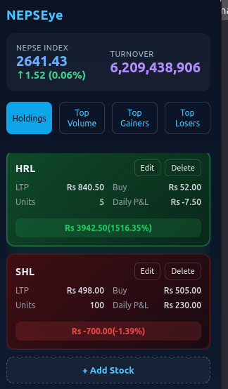

# NEPSEye

🔗 Firefox Add-ons: https://addons.mozilla.org/firefox/addon/nepseye/

NEPSEye is a lightweight Firefox extension that provides quick access to the NEPSE index and market turnover without repeatedly opening the NEPSE website. It initially started as a personal tool and later evolved into a public extension.

## Features
- NEPSE index overview
- Market turnover display
- Portfolio holdings view (experimental)
- Profit / Loss (P&L) calculation (experimental)

## Roadmap
- [ ] Top gainers
- [ ] Top losers
- [ ] Top volume stocks

## Why this exists
A quick glance at market data is often enough. NEPSEye helps reduce distractions by showing essential NEPSE information directly in the browser.

## Current status
This project is in an early stage of development.
- Core UI and layout are implemented
- Index and turnover data works
- Additional features are planned

## Development Setup
1. Clone this repository
2. Open Firefox and go to `about:debugging`
3. Click **This Firefox**
4. Click **Load Temporary Add-on**
5. Select the `manifest.json` file

## Tech Stack
- JavaScript
- Firefox WebExtensions API
- HTML / CSS

## Screenshots

## Contributing
Pull requests and suggestions are welcome.

## Disclaimer
This project is not affiliated with or endorsed by NEPSE.
